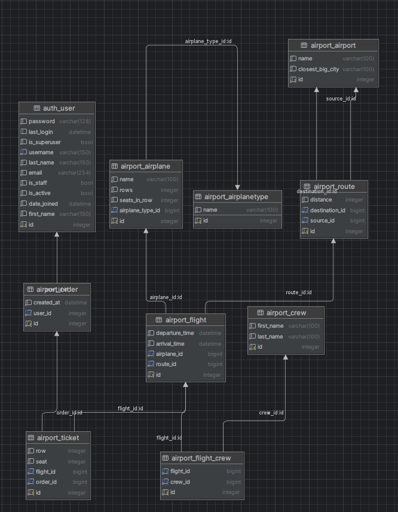

# airport_service

Django Backend for Airport Management System

This project is a backend service for managing flights, planes, staff, and clients in an airport. 
It is built using Django and Django REST Framework (DRF), providing a secure and scalable system for handling various operations within an airport environment.

## Installation

Python3 must be already installed 

```shell
git clone https://github.com/sind14/"project"
cd airport_service
python3 -m venv venv 
source venv/bin/activate
pip install -r reguirements.txt 
python manage.py runserver # starts Django Server 
```

## Features 

* Token Authentication 
* Different Permissions for Admins and Clients 
* Plane Images in Database
* User Registration System
* Flight Management
* Ticket Booking System
* Airport and Airplane Management
* Route Management
* Flight Crew Management

## Diagram


